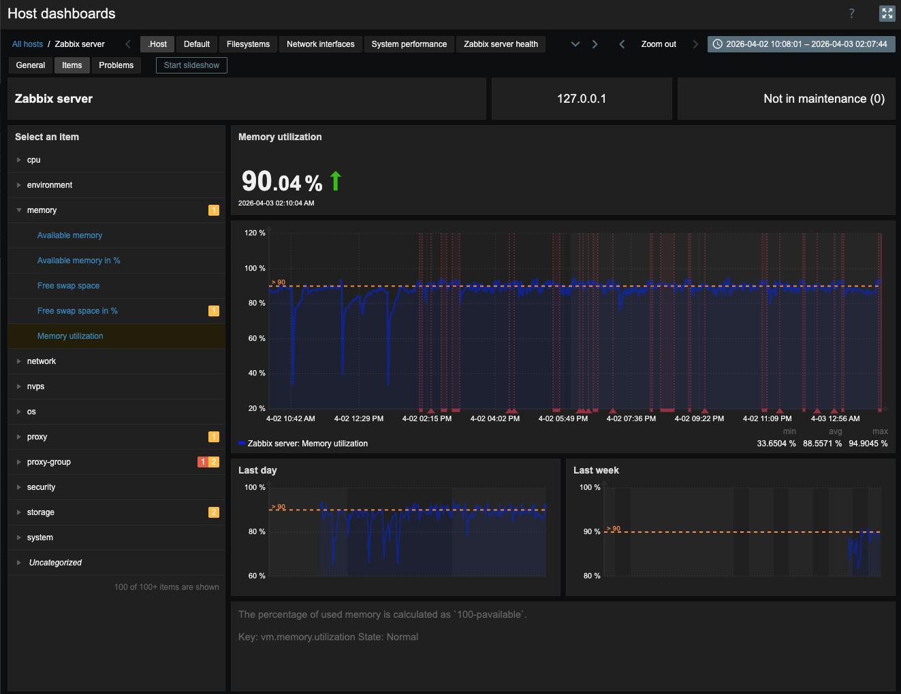
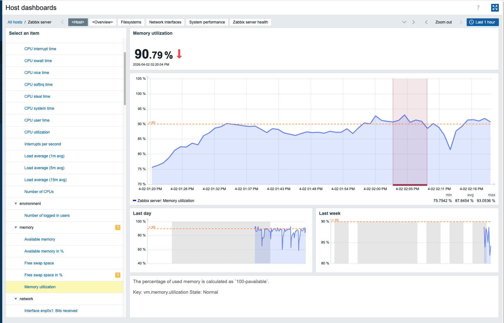
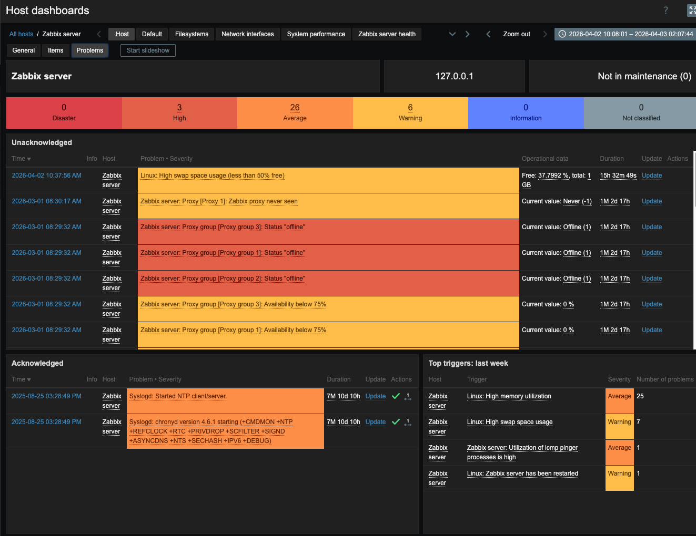
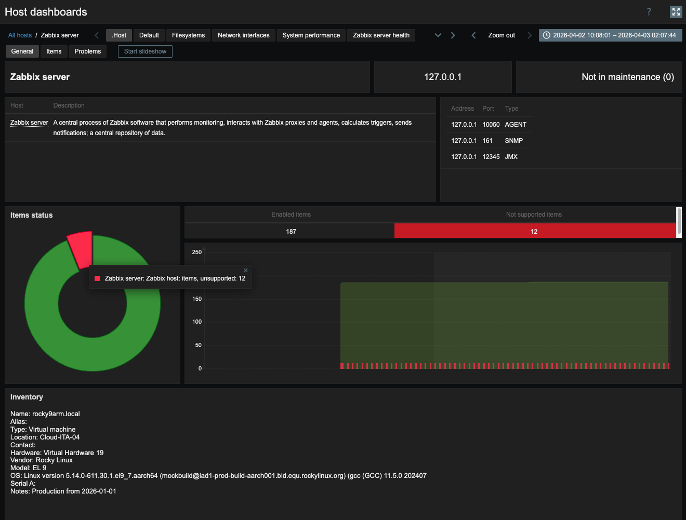

# Zabbix Universal Basic Template

## Goal
This simple template adds a basic dashboard to any existing host, providing inexperienced users with an easy and comprehensive host-centric view to explore:

* **All host items**, including graphs and descriptions.
* **All host problems**, including those already acknowledged.
* **General host information** (hostname, address, interfaces, inventory) and monitoring status (maintenance, unsupported items).

This information is usually scattered across different Zabbix pages (Latest Data, Monitoring, etc.), making it difficult to access for new Zabbix users.

---

## Features

* **Universal**: Can be applied to any host; it will display data from any already linked templates.
* **No dependencies**: Built using Zabbix 7.0 standard widgets (no custom widgets required).
* **Dark mode friendly**: Fully compatible with both Blue and Dark themes.
* **Seamless workflow**: Works alongside all your existing templates and templated dashboards.
* **Quick access**: The ".Host" dashboard is designed to always be the first tab in the list.

### Items page
Allows you to navigate through all host items, grouped by the _component_ tag (which should exist in all default templates according to the [Zabbix Template Guidelines](https://www.zabbix.com/documentation/guidelines/en/template_guidelines)).

### Problems page
View all current problems, track acknowledged events, and identify the most recurring issues from the last week (Top Triggers).

### General page

## Requirements
* **Zabbix 7.0.x** (Compatible with 7.2 and 7.4).

## How to use
1.  Import the template via YAML.
2.  Link the template to your hosts.
3.  Navigate to **Monitoring > Hosts** and click on **Dashboards**.
4.  *(Optional)* Consider installing [this module](https://github.com/bitmind/zabbix-search-page-plus/) to improve the visibility of dashboard links.

---

## Limitations
* **Host-centric**: This dashboard is optimized for single-host analysis. For multi-host monitoring, use the default Zabbix pages (Latest Data, Problems, etc.).
* **Standard widgets limitations**: The dashboard currently lacks some information (interface availability, proxy status, number of unsupported LLDs, links to unsupported objects, and a complete Inventory view) as these cannot be displayed using standard Zabbix 7.0 widgets. This may be updated in future versions.

* **Caution**: The template includes several "Internal type" items to gather host metadata (unsupported items, interfaces, maintenance status): on large installation please evaluate the impact on your Zabbix instance before applying it to thousands of hosts.
